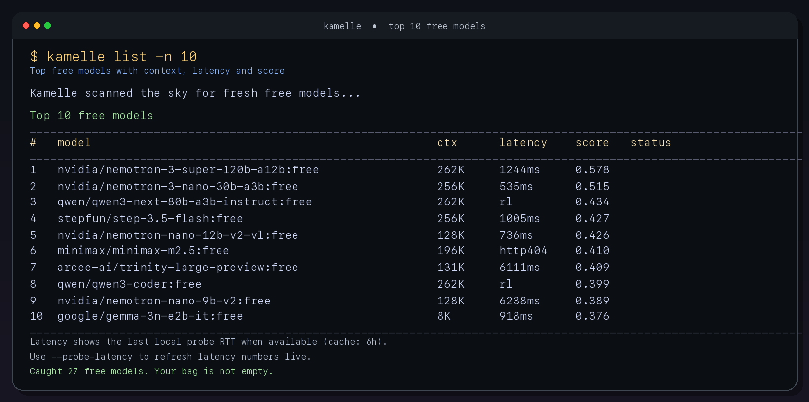

# Kamelle 🍬✨

**Catch the best free models before they're gone.**

Kamelle is a lightweight CLI for discovering, ranking, and syncing the best free OpenRouter models into OpenClaw.

Think of Kamelle as your big sister at carnival 🎉 — eyes on the sky, spotting the best free candy, helping you grab the good stuff before it hits the ground. Only here, the candy is free LLM tokens.

> Free models come and go. Kamelle keeps your bag stocked with the good stuff. 👜



## What Kamelle does

- 🍬 discovers free OpenRouter models live from OpenRouter
- ✨ ranks them with simple, sensible scoring
- ⚡ shows cached local latency probes in `kamelle list`
- 👜 refreshes a local cache every hour if you enable the refresh helper
- 💖 can set a best primary model and a fallback chain for OpenClaw
- 🔁 stores a backup so you can roll back if needed
- 🛠️ includes a doctor command and dry-run mode for safer changes

## Commands

- `kamelle list`
- `kamelle refresh`
- `kamelle status`
- `kamelle doctor --online`
- `kamelle auto`
- `kamelle switch <model>`
- `kamelle fallbacks`
- `kamelle rollback`

## Quick start

```bash
git clone https://github.com/l0hde/kamelle.git
cd kamelle
./scripts/install-local.sh
kamelle doctor --online
kamelle list -n 10
```

If `~/.local/bin` is not on your `PATH` yet, run:

```bash
~/.local/bin/kamelle status
```

## Beginner guide for OpenClaw users

Kamelle works best with OpenClaw if you already have:

- Python 3 installed
- an OpenRouter API key
- a working OpenClaw setup

### 1) Make sure your OpenRouter API key is available

At minimum, this works in your current shell:

```bash
export OPENROUTER_API_KEY="sk-or-v1-..."
```

If OpenClaw already has that key in its config or environment, Kamelle will pick it up automatically. 💫

### 2) Install Kamelle

```bash
git clone https://github.com/l0hde/kamelle.git
cd kamelle
./scripts/install-local.sh
```

### 3) Check that everything works

```bash
kamelle doctor --online
kamelle list -n 10
```

### 4) Safest first real use

If you want Kamelle to improve your free-model fallbacks **without replacing your current primary model**, start here:

```bash
kamelle auto --keep-primary --dry-run
kamelle auto --keep-primary
```

### 5) Optional: refresh the free-model catalog every hour on macOS

```bash
./scripts/install-hourly-refresh.sh
```

That refreshes the Kamelle cache only — it does **not** silently switch your main model.

## Beginner guide for other AI agent setups

If you're using another local AI tool, agent runtime, or automation setup, Kamelle can still be useful as a free-model scout.

The most useful commands are:

```bash
kamelle doctor --online
kamelle list -n 10 --probe-latency
kamelle refresh
```

Even without OpenClaw integration, Kamelle can still help you:

- discover free models
- compare context windows
- compare simple latency probes
- keep a fresh local cache of what is currently free

## Copy-paste prompt for AI agents

You can give this to OpenClaw, Codex, Claude Code, or another coding agent:

```text
Install Kamelle from https://github.com/l0hde/kamelle.

Steps:
1. Clone the repository.
2. Run ./scripts/install-local.sh
3. Run kamelle doctor --online
4. Run kamelle list -n 10 --probe-latency
5. If ~/.local/bin is not on PATH, use ~/.local/bin/kamelle instead.
6. Do not change my current primary model unless you show me a dry run first.
7. If everything works, optionally install hourly refresh on macOS with ./scripts/install-hourly-refresh.sh

At the end, summarize what you installed, where Kamelle lives, and which command I should run first.
```

## Example commands

```bash
kamelle list -n 10 --probe-latency
kamelle auto --keep-primary --dry-run
kamelle auto --keep-primary
kamelle switch qwen3-coder --dry-run
kamelle rollback
```

## Hourly refresh on macOS

```bash
cd kamelle
./scripts/install-hourly-refresh.sh
```

This installs a LaunchAgent that runs:

```bash
kamelle refresh
```

every hour. It refreshes the cache only — it does **not** silently change your primary model. Kamelle stays helpful, not sneaky. 💫

## Safety

Mutating commands support `--dry-run`, so Kamelle can show the plan before it moves any candy.

## Why it exists

OpenRouter's free lineup changes fast. A model that looked great yesterday may be rate-limited, slower, or gone today. Kamelle keeps that moving target manageable without turning your setup into a black box.
