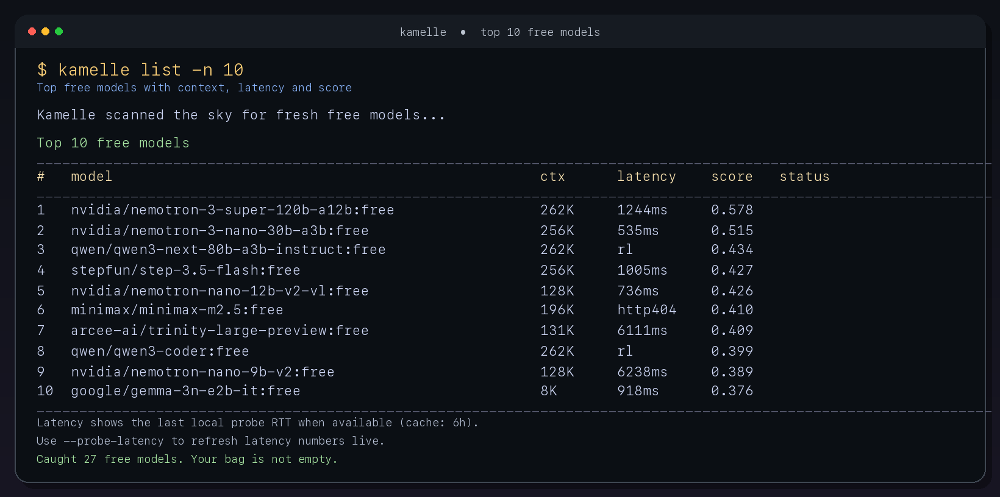

# Kamelle 🍬✨

**Catch the best free models before they're gone.**

Kamelle is a lightweight CLI for discovering, ranking, and syncing the best free OpenRouter models into your AI agent — OpenClaw, Hermes, or anything else at all.

Think of Kamelle as your big sister at carnival 🎉 — eyes on the sky, spotting the best free candy, helping you grab the good stuff before it hits the ground. Only here, the candy is free LLM tokens.

> Free models come and go. Kamelle keeps your bag stocked with the good stuff. 👜
>
> In many setups, that means you can run OpenClaw or other local AI-agent workflows on free models **without paying for a model subscription** — as long as OpenRouter still offers free models and you already have your local tooling in place. 💫



## What Kamelle does

- 🍬 discovers free OpenRouter models live from OpenRouter
- ✨ ranks them with simple, sensible scoring
- ⚡ shows cached local latency probes in `kamelle list`
- 👜 refreshes a local cache every hour if you enable the refresh helper
- 💖 can set a best primary model and a fallback chain for OpenClaw, Hermes, or any other agent
- 🔁 stores a backup so you can roll back if needed
- 🛠️ includes a doctor command and dry-run mode for safer changes

## Commands

- `kamelle agents`
- `kamelle list`
- `kamelle refresh`
- `kamelle status`
- `kamelle doctor --online`
- `kamelle auto`
- `kamelle switch <model>`
- `kamelle fallbacks`
- `kamelle rollback`
- `kamelle bench`
- `kamelle watch`
- `kamelle history`

## Agents

Kamelle writes its pick into whichever agent you point it at. One flag, same
commands:

```bash
kamelle agents                      # which backends exist, and which are installed
kamelle auto                        # OpenClaw (the default)
kamelle auto --agent hermes         # Hermes
kamelle auto --agent generic        # print JSON, wire it up yourself
```

| agent      | what Kamelle writes                                                  |
|------------|----------------------------------------------------------------------|
| `openclaw` | `agents.defaults.model.primary` + `.fallbacks` in `~/.openclaw/openclaw.json` |
| `hermes`   | `model.default` + the `fallback_providers` chain in `~/.hermes/config.yaml` |
| `generic`  | a plain JSON or YAML document, on stdout or in a file you name        |

Set `KAMELLE_AGENT=hermes` to make one of them your default, or
`--agent-config PATH` to work on a config file somewhere else (a second
profile, a dry run on a copy).

Kamelle edits YAML line by line rather than re-serialising it, so the comments
in your `~/.hermes/config.yaml` come back exactly as you wrote them. It also
re-reads what it produced and refuses to write anything that did not come back
as intended.

### The generic adapter

For agents Kamelle has no dedicated backend for. It makes no assumptions about
your config schema — it just states the result:

```bash
kamelle auto --agent generic > models.json
kamelle auto --agent generic -o out=~/.myagent/models.yaml
```

```json
{
  "kamelle": { "version": "0.2.0", "generated_at": "2026-09-22T14:02:11" },
  "provider": { "name": "openrouter", "base_url": "https://openrouter.ai/api/v1", "api_key_env": "OPENROUTER_API_KEY" },
  "primary": "qwen/qwen3-coder:free",
  "fallbacks": ["openrouter/free", "deepseek/deepseek-r1:free"]
}
```

With no `out=`, the document goes to stdout and Kamelle's own output moves to
stderr, so the redirect above stays clean. The format follows the file suffix
(`.yaml`/`.yml` → YAML, anything else → JSON) unless you pass `-o format=yaml`.

### Adding an agent

One file in `kamelle/adapters/`, one entry in `ADAPTERS`. An adapter answers
four questions about its agent — how to read its config, what that config
currently selects, how to put a new selection into it, and how to write it back
— plus how to back it up. Nothing else in Kamelle needs to know your agent
exists. See `kamelle/adapters/base.py`.

## Quick start

```bash
git clone https://github.com/l0hde/kamelle.git
cd kamelle
./scripts/install-local.sh
kamelle doctor --online
kamelle list -n 10
```

If `~/.local/bin` is not on your `PATH` yet, run:

```bash
~/.local/bin/kamelle status
```

## Beginner guide for OpenClaw users

Kamelle works best with OpenClaw if you already have:

- Python 3 installed
- an OpenRouter API key
- a working OpenClaw setup

### 1) Make sure your OpenRouter API key is available

At minimum, this works in your current shell:

```bash
export OPENROUTER_API_KEY="sk-or-v1-..."
```

If OpenClaw or Hermes already has that key in its own config, Kamelle will pick it up automatically. 💫

### 2) Install Kamelle

```bash
git clone https://github.com/l0hde/kamelle.git
cd kamelle
./scripts/install-local.sh
```

### 3) Check that everything works

```bash
kamelle doctor --online
kamelle list -n 10
```

### 4) Safest first real use

If you want Kamelle to improve your free-model fallbacks **without replacing your current primary model**, start here:

```bash
kamelle auto --keep-primary --dry-run
kamelle auto --keep-primary
```

### 5) Optional: refresh the free-model catalog every hour on macOS

```bash
./scripts/install-hourly-refresh.sh
```

That refreshes the Kamelle cache only — it does **not** silently switch your main model.

## Beginner guide for Hermes users

Kamelle talks to Hermes out of the box:

```bash
kamelle agents                                  # confirm Hermes was found
kamelle auto --agent hermes --dry-run           # see the plan first
kamelle auto --agent hermes                     # apply it
kamelle rollback --agent hermes                 # undo, byte for byte
```

It sets `model.default` to the best free model, points `model.provider` at
OpenRouter, and writes the rest of the ranking into `fallback_providers` — the
same chain `hermes fallback list` shows you. Your comments and every unrelated
setting in `config.yaml` stay exactly as they were.

If your OpenRouter key lives in `~/.hermes/.env` rather than your shell,
Kamelle picks it up from there.

## Beginner guide for other AI agent setups

If you're using another local AI tool, agent runtime, or automation setup, use
the generic adapter and wire the result in yourself:

```bash
kamelle auto --agent generic -o out=~/.myagent/models.json
```

That also means many people can experiment with AI agents **without committing to paid model subscriptions first** — which is kind of the whole magic trick. 🍬

And with no adapter at all, Kamelle is still a free-model scout:

```bash
kamelle doctor --online
kamelle list -n 10 --probe-latency
kamelle refresh
```

- discover free models
- compare context windows
- compare simple latency probes
- keep a fresh local cache of what is currently free

## Copy-paste prompt for AI agents

You can give this to OpenClaw, Codex, Claude Code, or another coding agent:

```text
Install Kamelle from https://github.com/l0hde/kamelle.

Steps:
1. Clone the repository.
2. Run ./scripts/install-local.sh
3. Run kamelle doctor --online
4. Run kamelle list -n 10 --probe-latency
5. If ~/.local/bin is not on PATH, use ~/.local/bin/kamelle instead.
6. Run kamelle agents and tell me which of my AI agents it found.
7. Do not change my current primary model unless you show me a dry run first.
8. If everything works, optionally install hourly refresh on macOS with ./scripts/install-hourly-refresh.sh

At the end, summarize what you installed, where Kamelle lives, and which command I should run first.
```

## Example commands

```bash
kamelle list -n 10 --probe-latency
kamelle bench -n 5
kamelle bench --json
kamelle auto --keep-primary --dry-run
kamelle auto --keep-primary
kamelle switch qwen3-coder --dry-run
kamelle rollback
kamelle agents
kamelle auto --agent hermes --dry-run
kamelle auto --agent generic -o out=models.yaml
```

## kamelle bench

`kamelle bench` sends a short standardised prompt to the top N free chat models and reports real response quality, not just latency:

```
# quick quality snapshot (5 models, parallel)
kamelle bench

# bench top 10, re-test everything ignoring cache
kamelle bench -n 10 --no-cache

# machine-readable output
kamelle bench --json
```

The bench scores (0-2 per model) feed back into Kamelle's ranking algorithm, so `kamelle auto` will prefer models that have demonstrably answered correctly over models that are merely large and recent.

Results are cached for 24 h — re-run with `--no-cache` to force fresh data.

**Bench checks:**
- Q1: `17 × 4 = 68`
- Q2: Capital of Germany = Berlin

Models that time out, return errors, or fail both checks get a small penalty in the ranking.

## Hourly refresh on macOS

```bash
cd kamelle
./scripts/install-hourly-refresh.sh
```

This installs a LaunchAgent that runs:

```bash
kamelle refresh
```

every hour. It refreshes the cache only — it does **not** silently change your primary model. Kamelle stays helpful, not sneaky. 💫

## Where Kamelle keeps its files

```
~/.kamelle/cache.json              the free-model catalog (1 h TTL)
~/.kamelle/state.json              latency probe results
~/.kamelle/bench.json              bench results (24 h TTL)
~/.kamelle/history.json            every switch Kamelle made, and for which agent
~/.kamelle/backups/<agent>.*       one rollback snapshot per agent
```

Before 0.2 these lived in `~/.openclaw/`, back when that was the only agent
Kamelle served. The old location is still read, so upgrading keeps your cache,
your history, and your rollback snapshot; new writes go to `~/.kamelle`. Set
`KAMELLE_HOME` to put them somewhere else.

## Safety

Mutating commands support `--dry-run`, so Kamelle can show the plan before it
moves any candy. Every applied change is backed up first, per agent, and
`kamelle rollback --agent <name>` puts the previous config back.

## Why it exists

OpenRouter's free lineup changes fast. A model that looked great yesterday may be rate-limited, slower, or gone today. Kamelle keeps that moving target manageable without turning your setup into a black box.
